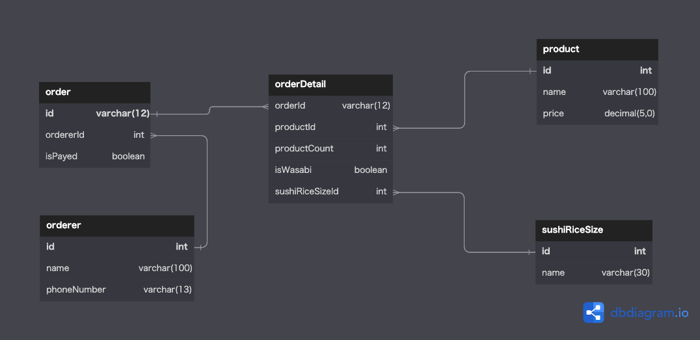
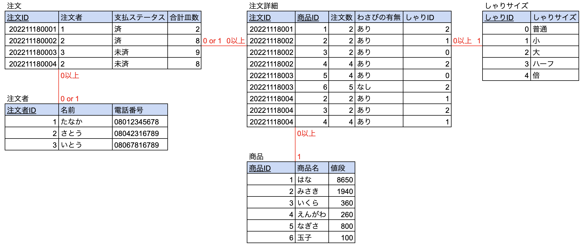
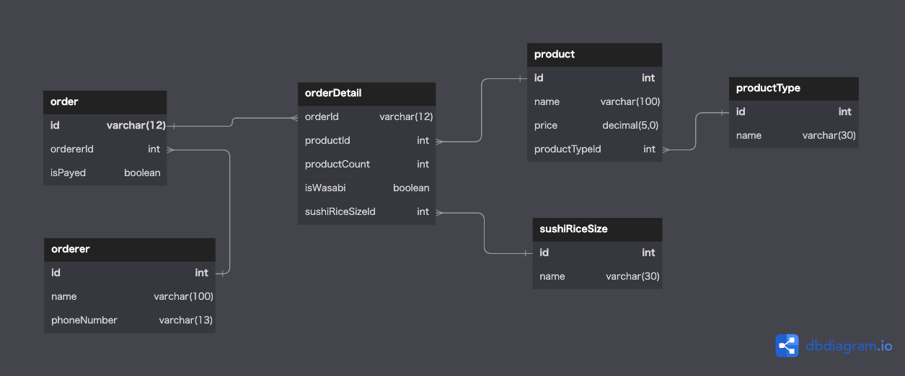
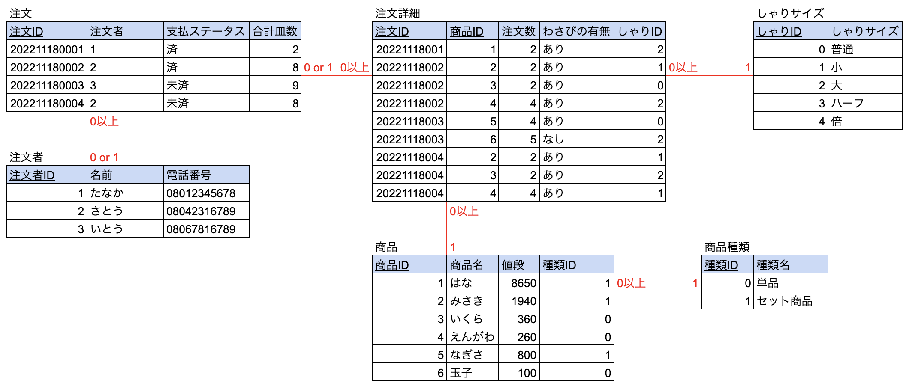

# 課題2
## 課題2-1
## ER図

### ER図への補足
####  カーディナリティ(dbでは表現できないので)
order : orderDetail  
0 or 1 : 0以上

order : orderer  
0以上 : 0 or 1

orderDetail : product  
0以上 : 1

orderDetail : sushiRiceSize  
0以上 : 1

## データイメージ

***

## 課題2-2
## ER図

### ER図への補足
####  カーディナリティ(dbでは表現できないので)
order : orderDetail  
0 or 1 : 0以上

order : orderer  
0以上 : 0 or 1

orderDetail : product  
0以上 : 1

orderDetail : sushiRiceSize  
0以上 : 1

product : productType  
0以上 : 1

## データイメージ

