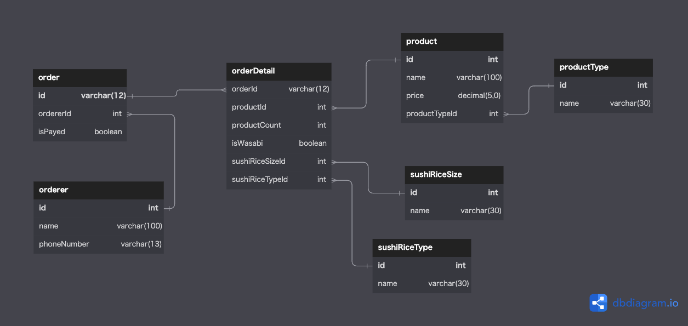
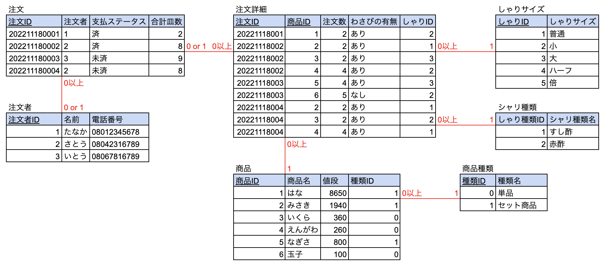

# 課題3
## トリオメンバーの追加仕様を盛り込む
しゃりは大きさだけでなく、しゃり自体の種類がネタによって変更されることがある。具体的には、すし酢を使う場合と赤酢を使う場合である。
## ER図

### ER図への補足
####  カーディナリティ(dbでは表現できないので)
order : orderDetail  
0 or 1 : 0以上

order : orderer  
0以上 : 0 or 1

orderDetail : product  
0以上 : 1

orderDetail : sushiRiceSize  
0以上 : 1

orderDetail : sushiRiceType
0以上 : 1

## データイメージ

